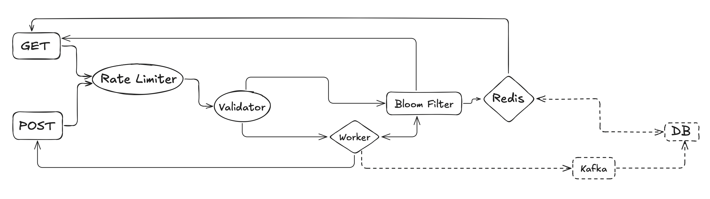

# URl-Shorten

## Description

## Prerequisite

- Docker (tested with version 25.0.3)
- Docker Compose (tested with version v2.24.6-desktop.1)

## Quick Start

```
$ git clone https://github.com/huanciou/url-shorten
$ cd ./url-shorten
$ docker-compose up -d
```

## Routes

### Get

- URL: http://localhost:3000/url_shorten/{short_url}
- Method: GET
- Description:

### POST

- URL: http://localhost:3000/url_shorten
- Method: POST
- Description:

### Check

- URL: http://localhost:3000/check
- Method: GET
- Description:

### Docs

- URL: http://localhost:3000/docs
- Method: GET
- Description: FastAPI - Swagger API

## API

- POST

| Parameter | Type | Required | Description                  |
| --------- | ---- | -------- | ---------------------------- |
| short_url | str  | Yes      | Base62(a-zA-Z0-9), length=11 |

- GET

| Parameter    | Type | Required | Description     |
| ------------ | ---- | -------- | --------------- |
| original_url | str  | Yes      | max_length=2048 |

## Features

## Error Handler

定義了 `CustomError` 與 `ServerInternalError` 兩種類別的錯誤
並在路徑分發之前， 加入 `excetion_handler`
並且在將可能發生錯誤的地方利用
`except` `raise` 來將錯誤分類與導向

## Vadlidation

使用 FastAPI 內建 Pydantic 庫來對用戶的 REQUEST 作驗證
包含對短網址、長網址的格式判斷

- class OriginalURL(BaseModel)
- class ShortURL(BaseModel)

而一但用戶發送的 REQUEST 不符合預期格式 raise 一個 Validation Error 至如上預定義的
Error Handler 中，返回給用戶對應的錯誤訊息

## Lifespan

使用 FastAPI 的 Lifespan 功能來集中管理多個事件: </br>
`redis_lifespan` 及 `rate_limiter_lifespan`
這種設計方法確保了在應用中的整個生命週期內，各種狀態、連接能夠被統一管理及運用

- 資源管理： 通過在 Lifespan 集中管理，可以確保每個資源只被初始化一次
- 狀態共享： 在 Lifespan 中可以在不同的 Req 和 Routes 中共享狀態。例如把 conn 除存在 app. state 當中，讓每個請求更方便訪問

# Rate-Limiter

## Bloom Filter

在初始化時，會基於 Redis 中的短網址建立 Bloom Filter，而使用的套件 `pybloom_live`
是一個 in-memory structure，該 BF 將短網址以二進制形式存儲，並作為 Redis 之前的判斷機制。其主要目的是作為緩衝區，以減少對 Redis 和資料庫的一次性大量 I/O 操作，且由於是進行 Bitwise 的操作，效率快速

BF 的特點在於能有效判斷短網址的存在性：如果判斷結果為「不存在」，則該短網址確實不存在，從而避免不必要的 Redis 查詢；如果判斷結果為「存在」，則存在一定的誤判概率（偽陽性），需要進一步在 Redis 中確認。這樣可以顯著提高系統的性能與效率

## Hash

使用 FNV-1a hash 來處理 UTF-8 編碼的長網址。該算法通過對每個字節進行操作，首先將當前字節與哈希值進行 XOR 運算，然後乘以一個大質數並作 mod，最終生成一個 uint，範圍在 0-2^64-1 之間

接下來將這個 uint 進行 Base62 轉換，以生成一個較短的唯一標識符
轉換後的結果長度在 1-11 個字元之間。為了確保最終的字串長度達到 11 個字元，使用 zfill 方法在字串的最前方補零。由於 Base62 編碼的特性，生成的字串不會以 0 開頭，因此這種補零方式不會與現有的字串產生 Collision。這種處理方式使得能夠有效將長網址轉換為短網址，同時確保生成的短網址具有統一的長度和唯一性

## LFU Cached

利用 Redis 在 4.0 版本後支援的 LRU、LFU cached 策略

```
redis.config_set("maxmemory-policy", "volatile-lfu")
redis.config_set("maxmemory", "100mb")
```

在 redis_init 後，導入 `volatile-lfu`。並針對本專案對 keys 涵蓋以下功能:

(1) 採用以 frequency 排序的快取，保持高熱點的短網址在隊列前方
(2) frequency decay 的應用讓在短時間頻繁訪問的短網址也會隨著時間降低頻率，而不讓快取策略失真
(3) 當容量得到快取上限，再度插入新的短網址時，會隨機選擇最低頻率的鍵刪除，解決固定刪除某一位置的問題

# Architecture


